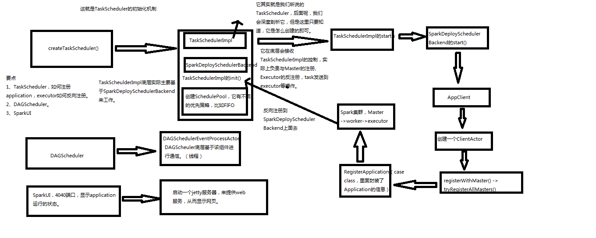

# SparkContext原理剖析与源码分析

## SparkContex原理剖析

### TaskScheduler

创建三个

- TaskSchedulerImpl：就是TaskScheduler
- SparkDeploySchedulerBacked：它在底层会接收TaskSchedulerImpl的控制，实际上负责与Master的注册、Executor的反注册，task发送到executor等等操纵，会调用TaskSchedulerImpl的init()
- 创建SchedulePool，它有不同的优先策略，比如FIFO

### DAGScheduler

- DAGSchedulerEventProcessAction：DAGScheduler底层基于该组件进行通信

### SparkUI

- 启动一个jetty服务器，来提供web服务，从而显示网页。

