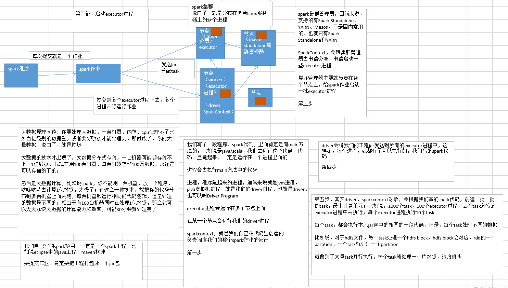

# Spark集群概览

## Spark集群架构

- spark程序每次提交就是一个作业，提交到多个executor进程上去，多个进程并行运行作业

**第一步**

- 我们写了一段程序，spark代码，里面肯定是有main方法的，比如说是java/scala，我们去运行这个代码，代码一旦跑起来，一定是运行在一个进程里面的
- 进程会去执行main方法中的代码
- 进程，程序跑起来的进程，通常来说就是jvm进程，java虚拟机进程，就是我们的driver进程，也就是driver，也可以叫Driver Program
- executor进程会运行在多个节点上面
- 在某一个节点会运行我们的driver进程
- Sparkcontext，就是我们自己在代码里创建的负责调度我们的整个spark作业的运行

**第二步**

- spark集群管理器，目前来说，支持的有Spark Standalone、YARN、Mesos，但是国内常用的，也就只有Spark Standalone和YARN
- SparkContext，会跟集群管理器去申请资源，申请启动一些executor进程
- 集群管理器主要就负责在各个节点上，给spark作业启动一批executor进程

**第三步**

- 启动executor进程

**第四步**

- driver会将我们的工程jar发送到所有的executor进程中，这样呢，每个进程，就都有了可以执行的，我们写的spark代码

**第五步**

- 其实driver，sparkcontext对象，会根据我们写的spark代码，创建一批一批的task，最小计算单元；比如说，1000个task，100个executor进程，会将task分发到executor进程中去执行；每个executor进程执行10个task
- 每个task，都会执行本地jar包中的相同的一段代码，但是，每个task处理不同的数据
- 比如说，对于hdfs文件，每个task处理一个hdfs block，hdfs block会对应，rdd的一个partition，一个task就处理一个partition
- 就做到了大量task并行执行，每个task就处理一小片数据，速度很快

## Spark集群架构的一些说明

- 每个spark application，都有属于自己的executor进程；绝对不可能出现多个spark application共享一个executor进程的
- executor进程，在整个spark application运行的生命周期内，都会一直存在，不会自己消失
- executor进程，最主要的，就是使用多线程的方式，运行SparkContext分配过来的task，来一批task就执行一批，一批执行完了，再换下一批task执行
- spark application，跟集群管理器之间，是透明的，不管你是哪个集群管理器，我就知道，我找你就可以申请到executor进程就好了
- 所以说，就算在一个能够容纳其他类型的计算作业的集群管理器中，也可以提交spark作业，比如说YARN、Mesos这种
- 大公司里，其实一般都是用YARN作为大数据计算作业管理器的，包括mapreduce、hive、storm和spark，统一在yarn上面运行，统一调度和管理公司的系统资源
- driver（其实也就是咱们的main类运行的jvm进程），必须时刻监听着属于它这个spark application的executor进程发来的通信和连接
- 而且driver除了监听，自己也得负责调度整个spark作业（你自己写的spark代码）的调度和运行，也得大量跟executor进程通信，给他们分派计算任务
- 所以driver在网络环境中的位置，还是很重要的，driver尽量离spark集群得近一些
- 上面说了，driver要调度task给executor执行，所以driver最好和spark集群在一片网络内

